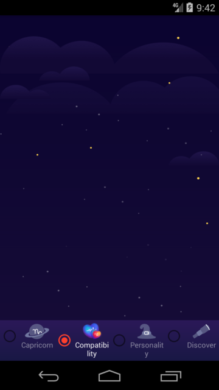

# 一个带缩放动画的 RadioButton

效果如图


## 一.处理低版本RadioButton问题

#### RadioButton在布局中的使用

```

    <RadioGroup
        android:id="@+id/rg_main"
        android:layout_width="0dp"
        android:layout_height="wrap_content"
        android:background="@drawable/bg_main_bottom"
        android:gravity="bottom"
        android:orientation="horizontal"
        android:paddingTop="4dp"
        android:paddingBottom="4dp"
        app:layout_constraintBottom_toBottomOf="parent"
        app:layout_constraintEnd_toEndOf="parent"
        app:layout_constraintStart_toStartOf="parent"
        app:layout_constraintTop_toBottomOf="@id/main_viewpager">

        <com.qingyc.basekit.widget.FixedAnimatedRadioButton
            android:id="@+id/rb_capricorn"
            android:layout_width="0dp"
            android:layout_height="wrap_content"
            android:layout_weight="1"
            android:button="@null"
            android:checked="true"
            android:drawableTop="@drawable/main_rb_01"
            android:gravity="center"
            android:text="@string/capricorn"
            android:textColor="@color/radio_btn_text_color"
            android:textSize="12sp"/>


        <com.qingyc.basekit.widget.FixedAnimatedRadioButton
            android:id="@+id/rb_compatibility"
            android:layout_width="0dp"
            android:layout_height="wrap_content"
            android:layout_weight="1"
            android:button="@null"
            android:checked="false"
            android:drawableTop="@drawable/main_rb_02"
            android:gravity="center"
            android:text="@string/compatibility"
            android:textColor="@color/radio_btn_text_color"
            android:textSize="12sp"/>


        <com.qingyc.basekit.widget.FixedAnimatedRadioButton
            android:id="@+id/rb_personality"
            android:layout_width="0dp"
            android:layout_height="wrap_content"
            android:layout_weight="1"
            android:button="@null"
            android:checked="false"
            android:drawableTop="@drawable/main_rb_03"
            android:gravity="center"
            android:text="@string/personality"
            android:textColor="@color/radio_btn_text_color"
            android:textSize="12sp"/>

        <com.qingyc.basekit.widget.FixedAnimatedRadioButton
            android:id="@+id/rb_discover"
            android:layout_width="0dp"
            android:layout_height="wrap_content"
            android:layout_weight="1"
            android:button="@null"
            android:checked="false"
            android:drawableTop="@drawable/main_rb_04"
            android:gravity="center"
            android:text="@string/discover"
            android:textColor="@color/radio_btn_text_color"
            android:textSize="12sp"/>


    </RadioGroup>
```


#### RadioButton在低版本上的问题(android 4.4)

可以看出在低版本的模拟器中 radioButton左边显示了一个默认button图标,xml中 ***android:button="@null"*** 无效



而在高版本的模拟器和手机中 显示正常


RadioButton的button图标的设置是在CompoundButton类中实现的 

#### android Api 28源码

```
    public CompoundButton(Context context, AttributeSet attrs, int defStyleAttr, int defStyleRes) {
        super(context, attrs, defStyleAttr, defStyleRes);

        final TypedArray a = context.obtainStyledAttributes(
                attrs, com.android.internal.R.styleable.CompoundButton, defStyleAttr, defStyleRes);

        final Drawable d = a.getDrawable(com.android.internal.R.styleable.CompoundButton_button);
        if (d != null) {
            setButtonDrawable(d);
        }

        if (a.hasValue(R.styleable.CompoundButton_buttonTintMode)) {
            mButtonTintMode = Drawable.parseTintMode(a.getInt(
                    R.styleable.CompoundButton_buttonTintMode, -1), mButtonTintMode);
            mHasButtonTintMode = true;
        }

        if (a.hasValue(R.styleable.CompoundButton_buttonTint)) {
            mButtonTintList = a.getColorStateList(R.styleable.CompoundButton_buttonTint);
            mHasButtonTint = true;
        }

        final boolean checked = a.getBoolean(
                com.android.internal.R.styleable.CompoundButton_checked, false);
        setChecked(checked);
        mCheckedFromResource = true;

        a.recycle();

        applyButtonTint();
    }

```

**a.getDrawable(com.android.internal.R.styleable.CompoundButton_button);** 获取xml中设置的button drawable,CompoundButton内部私有成员变量 **mButtonDrawable** 即是


可以看出最终会调用下面两个方法
```

    /**
     * Sets a drawable as the compound button image given its resource
     * identifier.
     *
     * @param resId the resource identifier of the drawable
     * @attr ref android.R.styleable#CompoundButton_button
     */
    public void setButtonDrawable(@DrawableRes int resId) {
        final Drawable d;
        if (resId != 0) {
            d = getContext().getDrawable(resId);
        } else {
            d = null;
        }
        setButtonDrawable(d);
    }

    /**
     * Sets a drawable as the compound button image.
     *
     * @param drawable the drawable to set
     * @attr ref android.R.styleable#CompoundButton_button
     */
    public void setButtonDrawable(@Nullable Drawable drawable) {
        if (mButtonDrawable != drawable) {
            if (mButtonDrawable != null) {
                mButtonDrawable.setCallback(null);
                unscheduleDrawable(mButtonDrawable);
            }

         mButtonDrawable = drawable

            if (drawable != null) {
                drawable.setCallback(this);
                drawable.setLayoutDirection(getLayoutDirection());
                if (drawable.isStateful()) {
                    drawable.setState(getDrawableState());
                }
                drawable.setVisible(getVisibility() == VISIBLE, false);
                setMinHeight(drawable.getIntrinsicHeight());
                applyButtonTint();
            }
        }
    }
    
```
可以看出不管是在xml 或者代码中设置RadioButton的button 最终都调用 setButtonDrawable(@Nullable Drawable drawable)

#### 对比Android api 19源码
[点击查看](http://androidxref.com/4.4.4_r1/xref/frameworks/base/core/java/android/widget/CompoundButton.java)

```groovy

    public void setButtonDrawable(Drawable d) {
        if (d != null) {
            if (mButtonDrawable != null) {
                mButtonDrawable.setCallback(null);
                unscheduleDrawable(mButtonDrawable);
            }
            d.setCallback(this);
            d.setVisible(getVisibility() == VISIBLE, false);
            mButtonDrawable = d;
            setMinHeight(mButtonDrawable.getIntrinsicHeight());
        }

        refreshDrawableState();
    }
```
  可以看出 输入drawable为null时根本没有调用 ***mButtonDrawable = drawable*** 把mButtonDrawable置空
 
 
#### 问题处理
```
  override fun setButtonDrawable(buttonDrawable: Drawable?) {
             // QTIP: 2019-04-28 修复低版本(android4.4)设置按钮为null时显示默认按钮
             if (Build.VERSION.SDK_INT <= Build.VERSION_CODES.KITKAT) {
                 try {
                     val clazz = CompoundButton::class.java
                     val field = clazz.getDeclaredField("mButtonDrawable")
                     field.isAccessible = true
                     field.set(this, null)
                 } catch (e: Exception) {
                     e.printStackTrace()
                 }
             } else {
                 super.setButtonDrawable(buttonDrawable)
             }
  }
```


## 二 实现点击RadioButton缩放动画

调用时机 check状态变化时
```

    override fun setChecked(checked: Boolean) {
        super.setChecked(checked)
        if (width == 0 || height == 0) {
            return
        }
        if (checked) {
            val animator = ValueAnimator.ofFloat(minScaleRate, maxScaleRate)
            animator.addUpdateListener(this)
            animator.duration = 300
            animator.start()
        } else {
            if (animatedScaleRate != 1f) {
                val animator = ValueAnimator.ofFloat(animatedScaleRate, 1f)
                animator.addUpdateListener(this)
                animator.duration = 0
                animator.start()
            }
        }
    }
```

RadioButton选中动画实现
```
   override fun onAnimationUpdate(animation: ValueAnimator?) {
        animatedScaleRate = animation?.animatedValue as Float
        try {
            //1.保存图标默认位置
            if (mDefaultDrawableBounds == null) {
                mDefaultDrawableBounds = arrayOfNulls(4)
                compoundDrawables.forEachIndexed { index, drawable ->
                    drawable?.let {
                        val rect = Rect(drawable.bounds)
                        mDefaultDrawableBounds?.set(index, rect)
                    }
                }
            }
            var leftDrawable: Drawable? = null
            var rightDrawable: Drawable? = null
            var topDrawable: Drawable? = null
            var bottomDrawable: Drawable? = null
            //2.获取radioButton中设置的图标的drawable
            compoundDrawables.forEachIndexed { index, drawable ->
                drawable?.let {
                    mDefaultDrawableBounds?.get(index)?.let { mDefaultDrawableBounds ->
                        val copyBounds = Rect(mDefaultDrawableBounds)
                        //3.动态缩放RadioButton的图标
                        copyBounds.let {
                            copyBounds.left = mDefaultDrawableBounds.left
                            copyBounds.right =
                                mDefaultDrawableBounds.right - (mDefaultDrawableBounds.width() * (1 - animatedScaleRate)).toInt()
                            copyBounds.top =
                                mDefaultDrawableBounds.top + (mDefaultDrawableBounds.height() * (1 - animatedScaleRate)).toInt() / 2
                            copyBounds.bottom =
                                mDefaultDrawableBounds.bottom - (mDefaultDrawableBounds.height() * (1 - animatedScaleRate)).toInt() / 2
                            when (index) {
                                0 -> {
                                    leftDrawable = drawable
                                    leftDrawable?.bounds = copyBounds

                                }
                                1 -> {
                                    topDrawable = drawable
                                    topDrawable?.bounds = copyBounds
                                }
                                2 -> {
                                    rightDrawable = drawable
                                    rightDrawable?.bounds = copyBounds
                                }
                                3 -> {
                                    bottomDrawable = drawable
                                    bottomDrawable?.bounds = copyBounds
                                }
                            }
                        }
                    }
                }
            }
            //4.更新图标大小和位置
            setCompoundDrawables(leftDrawable, topDrawable, rightDrawable, bottomDrawable)

        } catch (e: Exception) {
        }
    }
```


